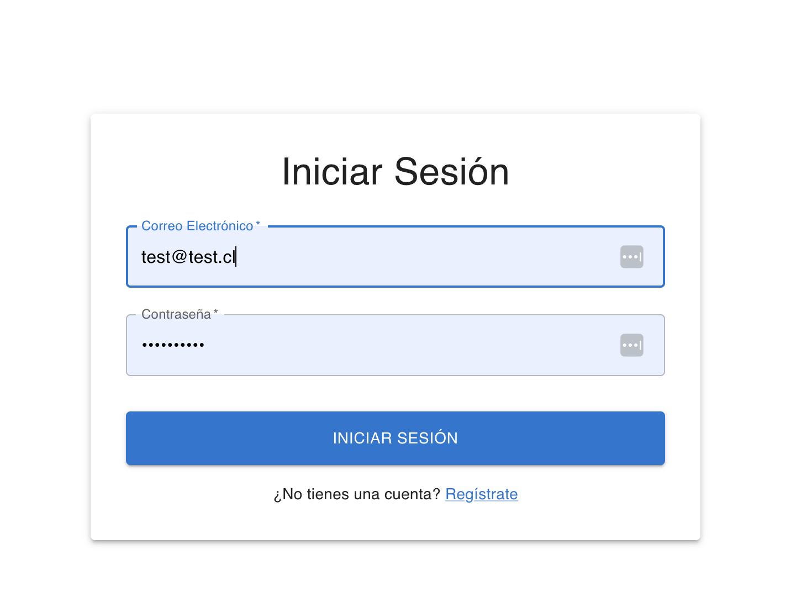

# dashboard-fullstack

## Carpetas:

- Frontend: React + TypeScript + Vite

- Backend: Nestjs + sequelize
- Crear archivo .env indicando nombre de base de datos, password y usuario (considerar archivo env.example)

## Uso de docker

Para correr este proyecto usar docker, en mi caso:

Usé colima para todo.
Desde el terminal:

brew install colima
brew install lima

colima start

Luego para levantar los contenedores:
Desde la carpeta CMPC-LIBROS, en un terminal:

docker-compose up

## Supuestos:

Se tienen dos gráficos de productos:

- Stock por producto
- Distribucion de precios
  Ademas, se tienen 2 metricas iniciales:
- Total de productos (tipos de productos)
- Ingresos totales

Los productos son obtenidos por medio de endpoints de productos, desde el backend, y las metricas son otro conjunto de endpoints (en este caso solo con la opcion de obtenerlas)

## Documentación utilizada

- Nestjs - [https://docs.nestjs.com/](https://docs.nestjs.com/)
- Redux - [https://redux.js.org/introduction/getting-started](https://redux.js.org/introduction/getting-started)
- Material UI [https://mui.com/material-ui/getting-started/](https://mui.com/material-ui/getting-started/)
- Plotly JavaScript - [https://plotly.com/javascript/](https://plotly.com/javascript/)

## Autor

Carolina Lagos - Ingeniero civil en informática
