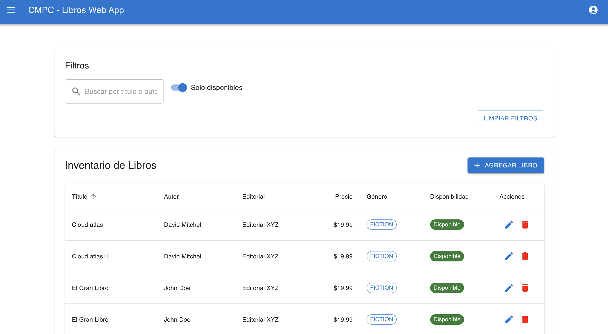

# CMPC-LIBROS

## Carpetas:

- Frontend: React + TypeScript + Vite

- Backend: Nestjs + sequelize
- Crear archivo .env indicando nombre de base de datos, password y usuario (considerar archivo env.example)

## Capturas de pantallas de la aplicación:

Capturas de la aplicación:




## Uso de docker

Para correr este proyecto usar docker, en mi caso:

Usé colima para docker.
Desde el terminal:

```bash
$ brew install colima
$ brew install lima
$ colima start
```

Luego para levantar los contenedores:
Desde la carpeta CMPC-LIBROS, en un terminal:

```bash
$ docker-compose up
```

## Para instalar nuevos paquetes:

### Eliminar el node modules:

```bash
$ rm -rf backend/node_modules
$ rm -rf frontend/node_modules
```

### Luego reconstruir el contenedor:

```bash
$ docker-compose up --build
```

# Levantar el proyecto:

Luego de levantar el contenedor:

```bash
$ http://localhost:3001/
```

## Modo de uso

### Indicaciones luego de levantar la aplicación:

- Ir desde el browser a [localhost](http://localhost:3001)
- Registrar un usuario
- Logearse con el usuario registrado
- Al loggearse accederá al panel de libros, aquí se puede probar agregar, editar, eliminar, filtrar y buscar libros.

# Swagger:

Para acceder a swagger, luego de levantar el contenedor:

```bash
$ http://localhost:3000/api-swagger
```

## Supuestos:

Se tienen dos gráficos de productos:

- Libros tienen atributos como: titulo, autor, editorial, precio, disponibilidad, género, stock, descripción y código isbn
- El género puede corresponder a un set definido de opciones como: no ficción, ficción, tecnología, historia, otros.

## Consideraciones

Por razones de tiempo algunas funacionalidades no fueron completadas:

Funcionalidades abordadas:

- Desarrollo de backend completo nestjs+ typescript con base de datos postgres, authenticación jwt.
- Configuración docker
- Desarrollo frontend (React + Vite + Typescript + MaterialUI)
- Implementación Swagger
- Implementación de algunos tests del backend con jest
- Diagrama de arquitectura C4 MODEL (nivel 2)
- Manejo de errores en backend y frontend
- Exportación csv desde el backend.
- Filtro por disponibilidad y búsqueda
- Funcionalidades de Agregar, editar y eliminar un libro.
- Registro, login y logout de usuario.

## Documentación utilizada

- Nestjs - [https://docs.nestjs.com/](https://docs.nestjs.com/)
- Material UI [https://mui.com/material-ui/getting-started/](https://mui.com/material-ui/getting-started/)
- React - [https://react.dev/reference/react](https://react.dev/reference/react)
- Colima - [https://github.com/abiosoft/colima](https://github.com/abiosoft/colima)

## Autor

Carolina Lagos - Ingeniero civil en informática
